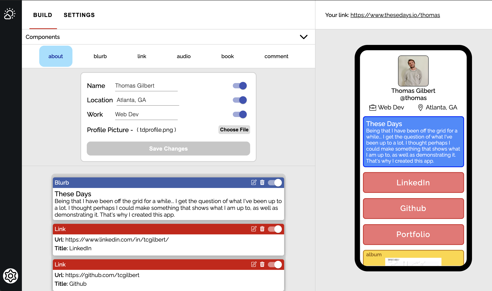

# These Days Front End

## About

*I am no longer paying for website hosting, so this site is no longer live*

<a target="_blank" href="https://www.thesedays.io/">These days</a> is a mobile website generator designed with the intention of providing a one-stop location to one's entire online footprint. The platform works as a kind of micro-blog that allows users to not only link to external sources, but also describe them. You can vist my link here --> <a target="_blank" href="https://www.thesedays.io/thomas">thesedays.io/thomas</a>

This repo works in congruance with its backend server --> <a target="_blank" href="https://github.com/tcgilbert/td-back">backend repo</a>

## Technologies and Tools

-   React
-   SCSS, Material UI
-   react-beautiful-dnd
-   jwt authentication
-   react-router-dom
-   Cloudinary photo storage
-   Heroku deployment

## Third party API's

-   `Spotify API` - for music and podcast data
-   `Google Books API` - for book images and info

---

## Overview

In many ways, this projects represents the culmination of my software education journey, of which I started close to a year ago now. I say that because this project represents a clear departure from a developer in trainer, to a self-sufficent full-stack engineer. That is not to say I still have a lot to learn, quite the opposite, there are many things I would have done differently if I were to start this project over. That said, the skills required to build this project are the foundation by which I intend to build on as I continue my development as an engineer. 

### User Sandbox



#### There are three major sections that make up this app's UI.

-   Components Dropdown

    -   Where the user creates new content for mobile site

    -   A goal of mine was for the user to not only share and write about what they are up to, but also share what they have been consuming culturally

    -   The Spotify API was great for this because it provided access to both music and podcasts

-   Drag and Drop Area

    -   Where the user can organize as well as update, delete, or hide content from feed

    -   To provide the Dnd functionality I used the `react-beautiful-dnd` library

        -   There was a bit of a learning curve, but once you get the hang of the syntax it is amazing how well this library works

-   Mobile Preview

    -   A real time preview of how the site will look on mobile display

    -   Believe it or not, creating this mobile preview was one of the most difficult parts of this entire project

        -   Because of all of the content within the phone (which is really just a rectangle div with a black border) I had to not only mantain the aspect ratio of the phone, but all of the content inside of it

        -   No silver bullet solution, just tons of CSS iteration to finally find something that worked

## Code examples

#### Fetching the user's content from backend

Okay, I am both proud and embarrassed of the code below because it is a little messy. That said, this useEffect that runs once the Spotify token is fetched is really at the heart of the application.

Because I did not want to store things like album art or book cover's in my database, this function is sifting through the user's content and fetching the necessary front end information from the third party API's prior to setting the content in state.

```javascript
// Fetch user's content
useEffect(() => {
    const fetchContent = async () => {
        if (username && spotifyToken) {
            try {
                const getUser = await axios.get(
                    `${SERVER}/users/unique/${username}`
                );
                const userId = await getUser.data.userId;
                setMaintenance(getUser.data.maintenance);
                const apiRes = await axios.get(`${SERVER}/about/${userId}`);
                const about = apiRes.data.about;
                setAbout(about);
                const apiRes2 = await axios.get(
                    `${SERVER}/content/getall/${userId}`
                );
                const content = apiRes2.data.userContent;
                await Promise.all(
                    content.map(async (ele) => {
                        if (ele.type !== "soundtrack" && ele.type !== "book") {
                            return ele;
                        } else if (ele.type === "soundtrack") {
                            let url;
                            if (ele.content.type === "show") {
                                url = `${spotifyEndpoint}${ele.content.type}s/${ele.content.spotifyId}?market=US`;
                            } else {
                                url = `${spotifyEndpoint}${ele.content.type}s/${ele.content.spotifyId}`;
                            }
                            let apiRes = await axios.get(url, {
                                method: "GET",
                                headers: {
                                    Authorization: "Bearer " + spotifyToken,
                                },
                            });
                            let newContent = await apiRes.data;
                            if (ele.content.type === "album") {
                                ele.content["artists"] = newContent.artists;
                                ele.content["name"] = newContent.name;
                                ele.content["images"] = newContent.images;
                            } else if (ele.content.type === "track") {
                                ele.content["artists"] = newContent.artists;
                                ele.content["name"] = newContent.name;
                                ele.content["images"] = newContent.album.images;
                                ele.content["album"] = newContent.album.name;
                            } else {
                                ele.content["name"] = newContent.name;
                                ele.content["images"] = newContent.images;
                            }
                            return ele;
                        } else {
                            let googleRes = await axios.get(
                                `https://www.googleapis.com/books/v1/volumes/${ele.content.apiId}?key=${GOOGLE_API_KEY}`
                            );
                            let bookContent = await googleRes.data.volumeInfo;
                            ele.content["authors"] = bookContent.authors;
                            ele.content["imgUrl"] =
                                bookContent.imageLinks.thumbnail;
                            return ele;
                        }
                    })
                );
                setContent(content);
                setContentLoading(false);
            } catch (error) {
                setContentLoading(false);
                setFourOhFour(true);
                console.log(error);
            }
        }
    };
    fetchContent();
}, [spotifyToken]);
```

### Lessons learned

1. Use `redux` for state management next time
    - While prop drilling was not that big of a problem, the organizational quality of this project would have greatly benefitted from the necessary structoring required of redux
2. File Structuring

    - Being that I built this project without any templates or outside help, as the project grew, I began to realize that my file organization could use an upgrade
    - I have sense made a point to improve on this, and if I were to start over I would be more intentional with my file naming as well as group the component with the styles in the same folder

        ```
        / components
            / navagation
                navagation.component.jsx
                navagation.styles.scss
        ```
